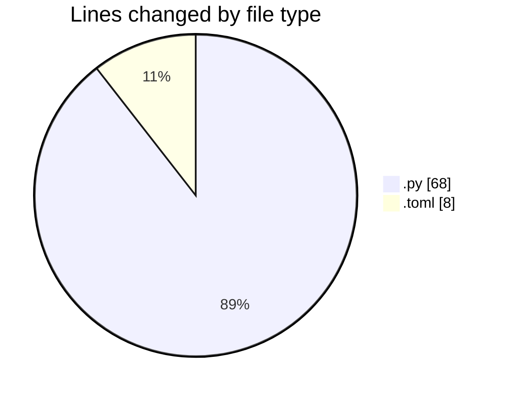
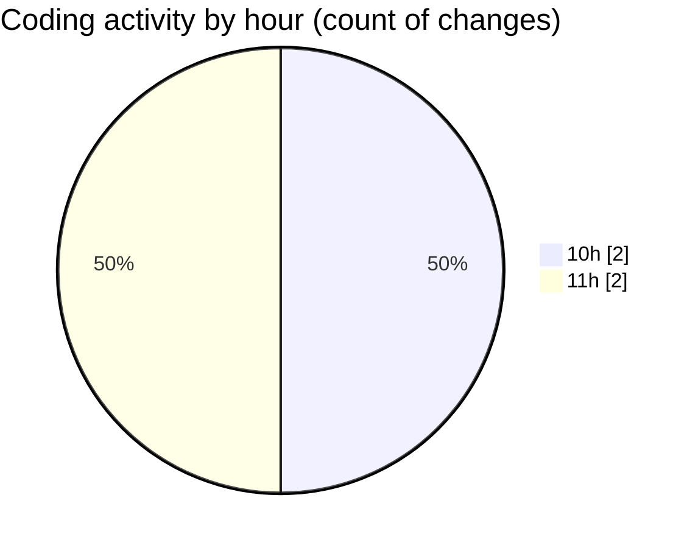

# synth_dist - Activity Summary 

## Overall Statistics

| Stat                   | Value                                                             |
| ---------------------- | ----------------------------------------------------------------- |
| **Lines Added** (➕)   | 76                                          |
| **Lines Removed** (➖) | 0                                        |
| **Net Change** (↕)    | 76                |
| **Active Time** (⌚)   | 5 minutes |

## Modified Files
- **main.py** (+68, -0)
- **pyproject.toml** (+8, -0)

## Visualizations

### By File Type (Lines Changed)

### By Hour (Estimated Activity Count)

> **Last Updated:** 4/9/2025, 11:07:15 AM