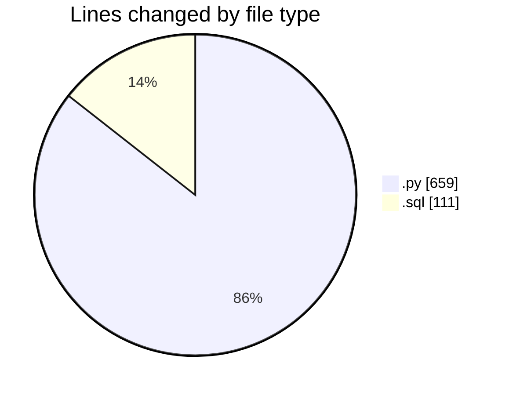
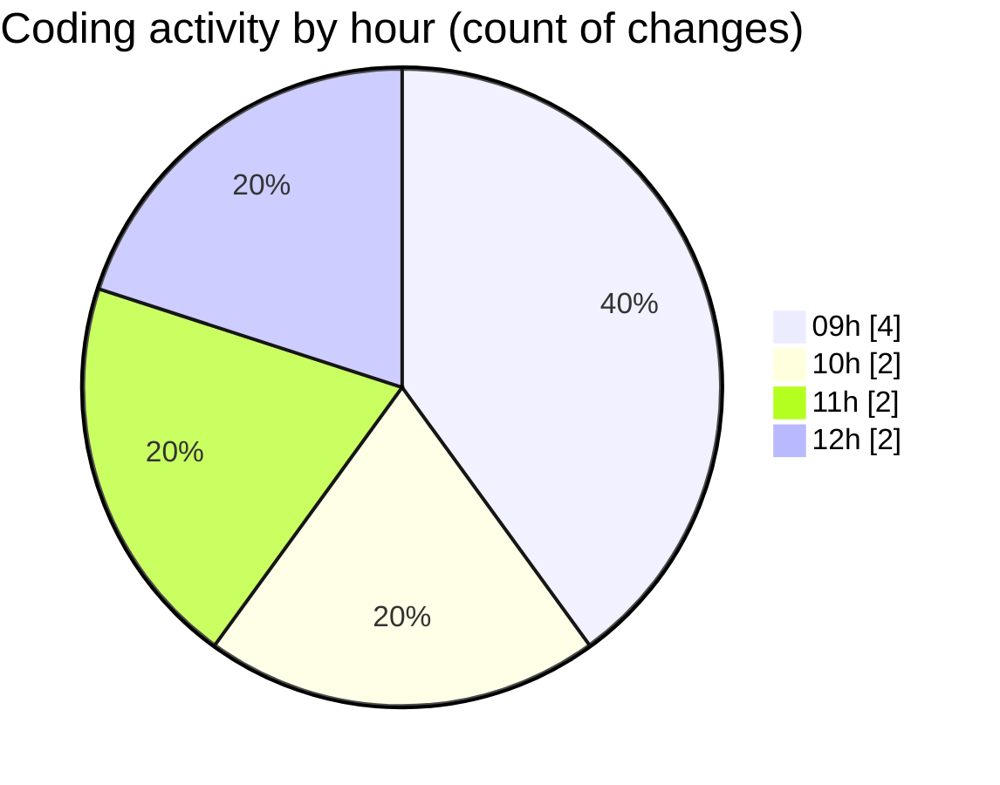

# synth_911data_gen - Activity Summary 

## Overall Statistics

| Stat                   | Value                                                             |
| ---------------------- | ----------------------------------------------------------------- |
| **Lines Added** (➕)   | 770                                          |
| **Lines Removed** (➖) | 0                                        |
| **Net Change** (↕)    | 770                |
| **Active Time** (⌚)   | 14 minutes |

## Modified Files
- **synth911gen.py** (+659, -0)
- **CallType_Generator.sql** (+111, -0)

## Visualizations

### By File Type (Lines Changed)

### By Hour (Estimated Activity Count)

> **Last Updated:** 4/22/2025, 12:09:33 PM